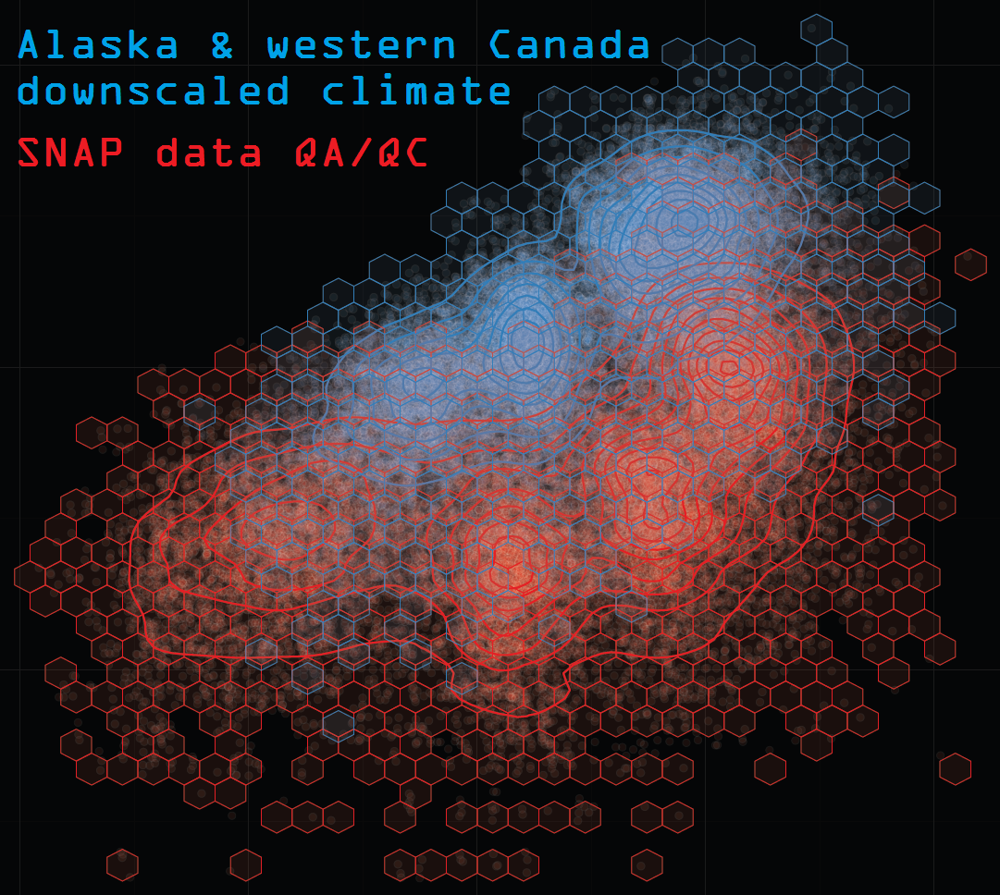
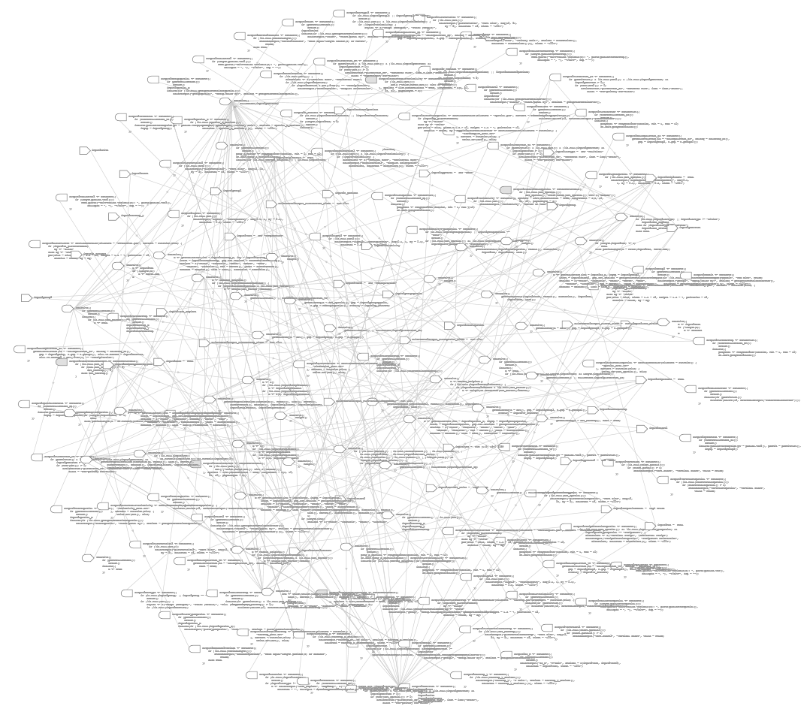

---
output:
  html_document:
    toc: false
    theme: flatly
    highlight: espresso
    keep_md: true
---

##
##
## QA/QC App 

This section documents the primary SNAP data QA/QC **R** Shiny app.
This app is under development and not available for public use.

The app compares downscaled outputs from AR4 (CMIP3) and AR5 (CMIP5) global climate models (GCMs) in a variety of ways.
Downscaled observation-based historical data from the Climatological Research Unit (CRU 3.2) can be included in comparisons as well.
Historical and projected climate can be explored at numerous temporal and spatial scales.
A variety of statistics are available, but examination of full distributional properties is also possible.

Currently, there are five main plot types focusing on exploratory data analysis: basic time series plots (not time series analysis), scatter plots, heat maps, various plots designed to highlight variability, and distributional plots.

### A sense of scale

The app is complex and makes use of large amounts of external data files, loading any required files on demand depending upon user input selections.
It is designed with this externalization of pre-processed data files so that it remains fast and responsive.
The app itself contains very little data to be loaded at launch.

See the interactive <a href="reactivity_at_launch.html" target="_blank">reactivity graph</a> for an limited illustration of the app's complexity.
Note that this graph is strictly of the reactivity which occurs at the instant the app is first launched.
None of the vast array of combinations of user interactions are included in the graph.
This is the initial state of the app.
Nevertheless, the complete graph does not come close to fitting on the screen.
Although the screen instructions suggest pressing the right arrow key to proceed step by step,
you may want to speed things up by simply holding down the right arrow key until the sequence has completed.

##

##

It is difficult to provide a single visual which describes the full scope and nature of reactive dependencies in this app,
which could be viewed as a collection of several related apps, none of which are simple even in isolation.
The following sections in this documentation include a limited user guide or collection of app help files,
as well as source code documentation.

Data files used by the app are large/many and fully externalized in a particular computing environment.
All source code is available for exploration, but this app will not run if downloaded.
Some data manipulations by the app are also so data-heavy and memory-intensive that they can only be performed in a server environment.
Due to its complexity and specificity, it also will not serve as a convenient and effective template for other Shiny apps.

A limited example app, using a subset of the source data and including more protections against memory overrun and general server resource competition with users of the same or other apps,
will be made available on a public server once the original app development is completed.
The date for this availability is undetermined.
Continued development is not a top priority.
Considering app development began in February, 2014, has continued intermittently since, and has a ways to go as of this update (April 2015), it may be a while yet.
