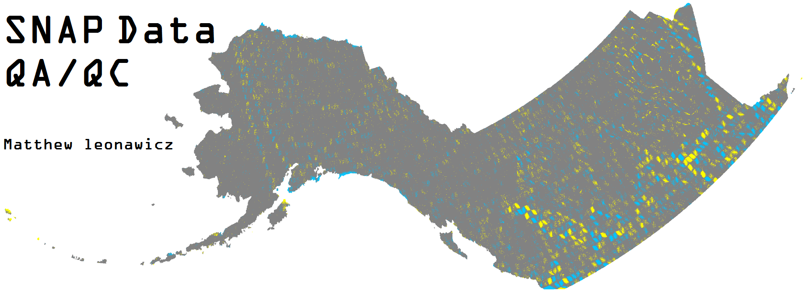

---
output:
  html_document:
    toc: false
    theme: cosmo
    highlight: zenburn
    keep_md: true
---

```{r knitr_setup, echo=FALSE}
opts_chunk$set(cache=FALSE, echo=FALSE, eval=TRUE, tidy=FALSE, message=FALSE, warning=FALSE)
read_chunk("../../code/code_sankey.R")
```

##
##
##


##

SNAP data QA/QC refers to multiple threads of collections of **R** code in the form of scripts and functions across various projects utilizing SNAP data sets.
However, there is particular focus on SNAP's gridded climate- and fire-related data products, including:

* 2-km resolution, Alaska-Western Canada extent, downscaled global climate model (GCM) temperature and precipitation outputs
* 2-km resolution, Alaska-Western Canada extent, downscaled Climatological Research Unit (CRU) 3.x temperature and precipitation data.
* 1-km resolution, Alaska-Western Canada extent, ALFRESCO fire and vegetation landscape transition simulation outputs.

The two most prominent threads of QA/QC relate to the climate data and ALFRESCO outputs noted above.
The QA/QC process involves extraction of data from geotiff layers of the above data products.
Data are extracted based on:

* The full spatial extent
* A collection of spatial regions defined by shapefile polygons
* Individual grid cells corresponding to point locations of interest, e.g., cities

The data extractions are intensive processes.
Depending on user configurations, these processes can take a while to execute.
Most of the scripts, particularly those upstream in the **R** code process chain which entail the heaviest I/O involving thousands of high-resolution geotiff files,
are called via SLURM scripts and handled by the SLURM job manager on the Atlas cluster.
This is considered best practice.
The code is executed in non-interactive mode **R** and does not require an existing connection to the server by the user except to initially launch the SLURM job.
Some of the downstream processes that perform relatively light organizational work on already parsed outputs do not use SLURM.

The process chain involves the following:

* Initial data extraction from source files
* Calculation of statistics on extracted outputs
* Writing extracted output statistics to new files, usually .RData workspaces
* Compiling and organizing statistics in a series of data curation steps, which may require a series of intermediary output files depending on the type of input
* Fully curated data files are made available to various projects, some unrelated and others which perform further QA/QC analyses, such as the master QA/QC Shiny app.

Currently, here you can find documentation, including **R** code, which covers most of the primary (extraction) and secondary (organization) stages pertaining to the two main threads of SNAP data QA/QC.
Before looking at the code, it may be helpful to capture the overall picture of the process chain by looking at the code flow diagram.

## Related items
SNAP QA/QC code feeds into many other projects, including the SNAP data QA/QC master **R** Shiny app, Community Charts apps, and ALFRESCO-related projects.
The primary order QA/QC code is most directly related to data extraction.
Secondary order code relates to organization and preparation of useful data products which are taken up by web applications and other projects to investigate the data.
Tertiary order code relates to specific QA/QC analyses.

### Files and data
This project makes use of any SNAP data, particularly gridded climate, fire, and vegetation data sets.
Files generated as part of SNAP QA/QC include fortified datasets which are more accessible, compact, easier to manipulate, understand, and analyze for specific purposes.

### SNAP QA/QC code flow

```{r sankey_packages}
```

```{r files}
```

```{r links, tidy=FALSE}
```

```{r igraph}
```

```{r rcharts}
```

```{r code_sankey_embed, comment=NA, results="asis", tidy=F}
```
<style>iframe.rChart{ width: 100%; height: 840px;}</style>
